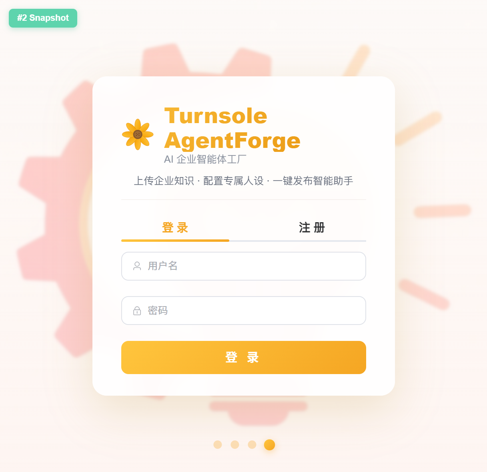
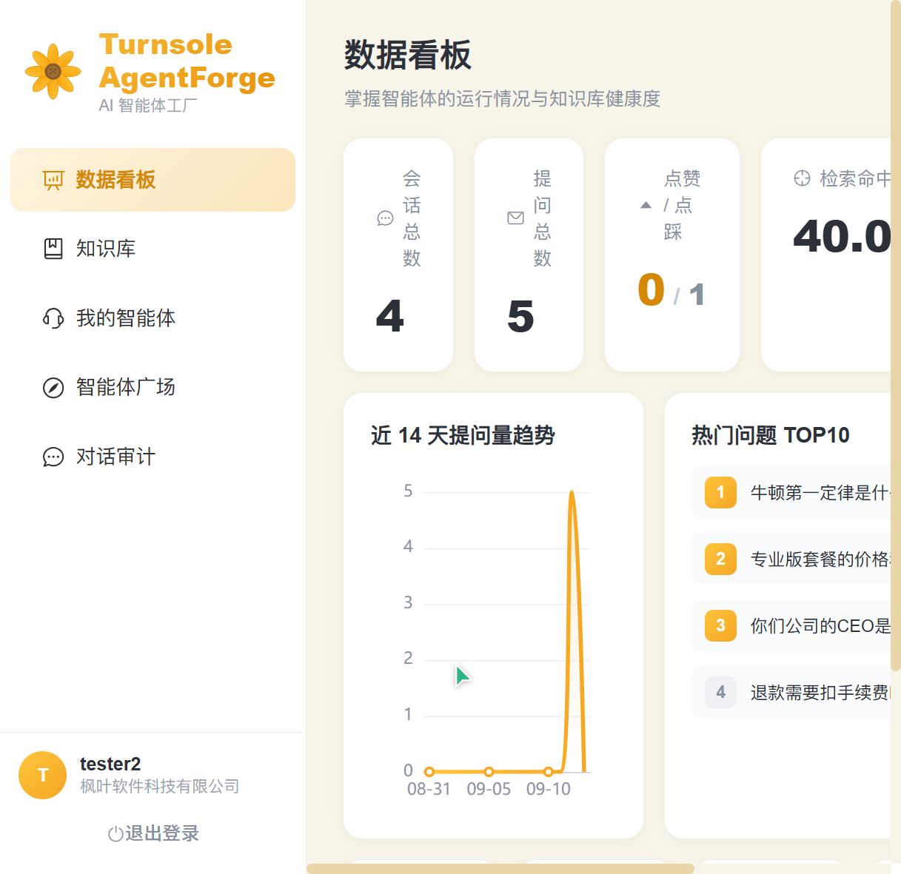
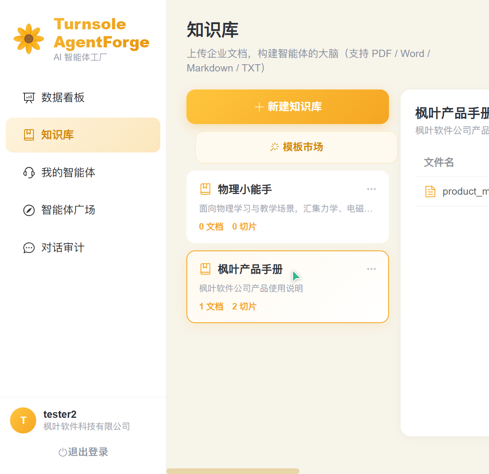
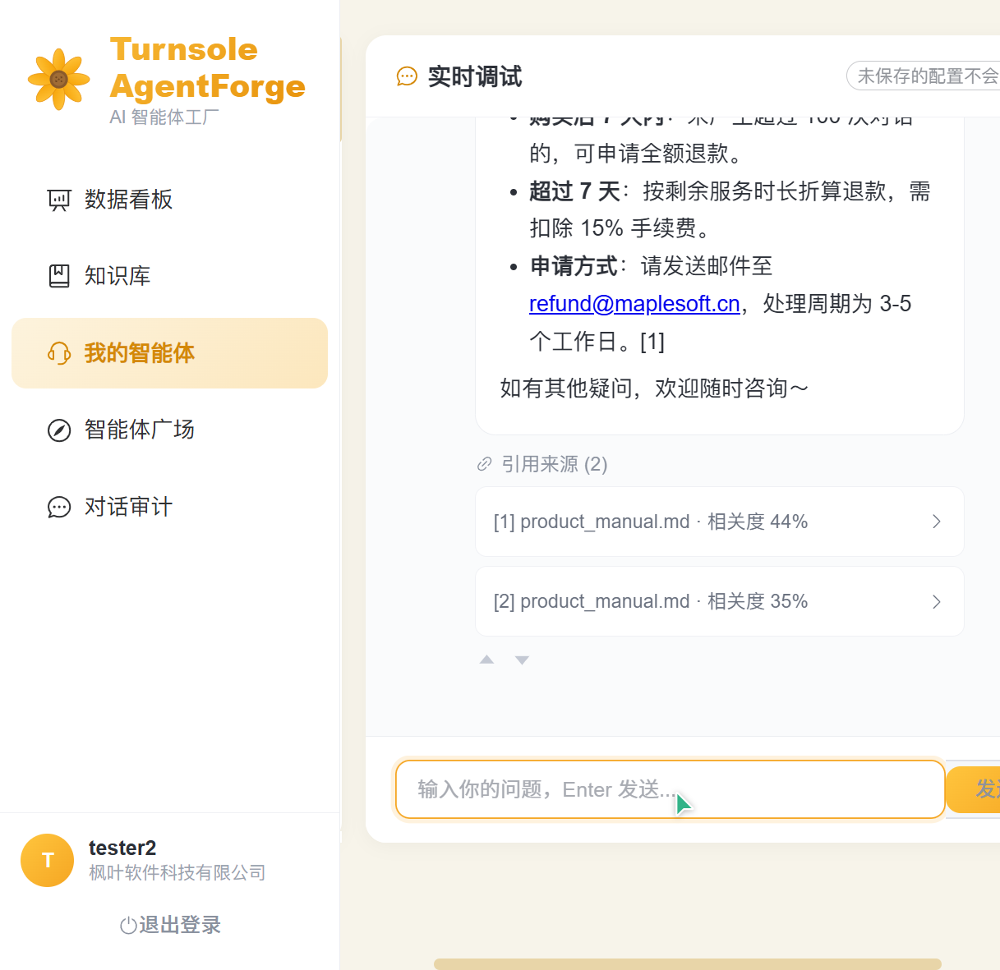
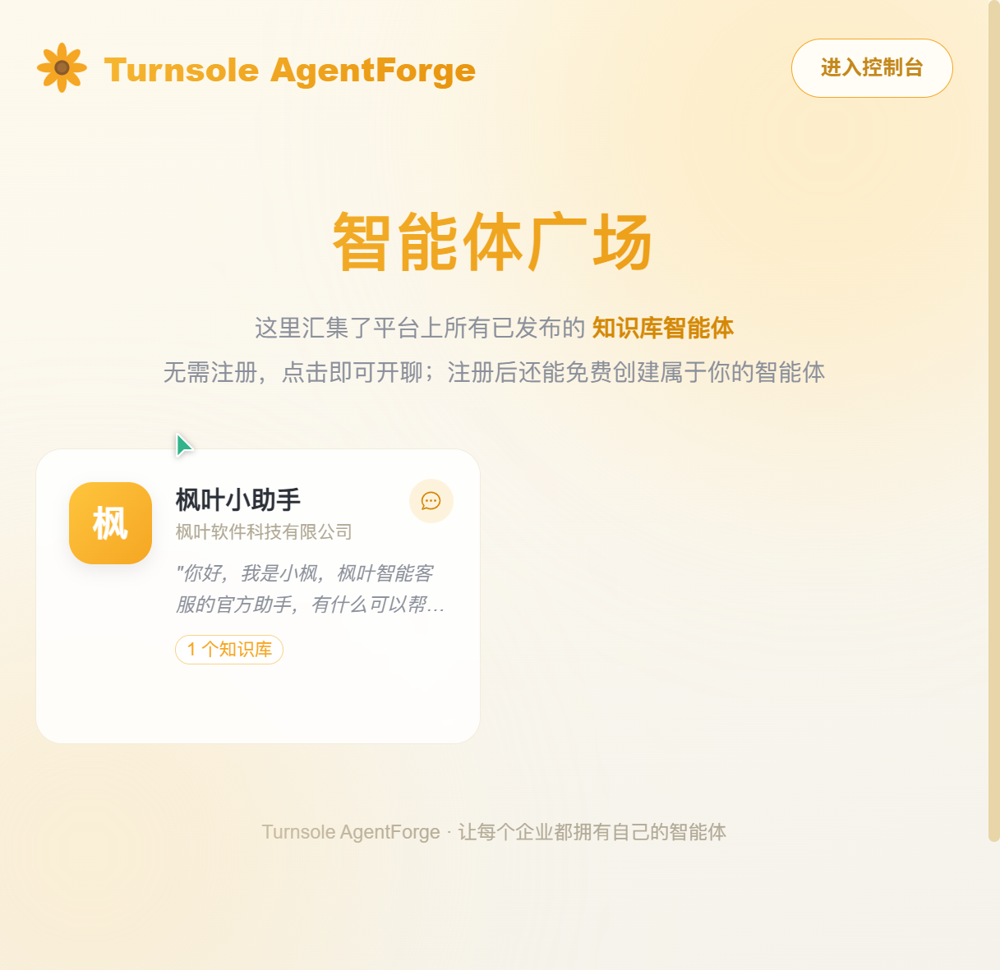

# 🌻 Turnsole AgentForge · 智能体工厂

> **多租户知识库智能体搭建平台** —— 上传文档、锻造智能体、发布到任何网站。
>
> Turnsole（向日花），向阳而生 —— 让每个企业的智能体，都向着知识生长。


基于 **RAG（检索增强生成）** 架构：企业注册后上传文档，AI 自动切片向量化，配置智能体人设后一键发布为可嵌入网站的智能问答助手，所有回答由 DeepSeek 实时生成并**附带引用溯源**。

## 📸 应用截图

| 登录页（背景轮播） | 数据看板 |
|:---:|:---:|
|  |  |

| 知识库管理（AI 生成文档） | RAG 对话（引用溯源） |
|:---:|:---:|
|  |  |

| 智能体广场（免登录体验） |
|:---:|
|  |

## ✨ 核心特性

1. **多租户体系** —— 注册即创建企业独立空间，知识库与向量数据租户隔离（MySQL `tenant_id` 贯穿 + ChromaDB 租户独立 collection 双重隔离）
2. **知识库流水线** —— 上传 PDF / Word / Markdown / TXT → 解析 → 中文语义切片 → BGE 向量化 → ChromaDB 入库，全程状态跟踪、失败重试
3. **AI 文档生成** —— 知识库内按主题 + 风格（教学讲解 / 制度手册 / FAQ / 科普）AI 撰写结构化文档并自动切片入库，解决空知识库冷启动
4. **AI 智能分析（多模式）** —— 知识库描述三种风格；智能体配置三件套（人设 + 开场白 + 推荐问题）四种风格，按知识库主题生成匹配的推荐问题
5. **模板市场** —— 内置 12 个企业高频场景知识库模板（产品手册 / 客服 FAQ / HR 制度等），点击即用
6. **智能体工作台** —— System Prompt、开场白、推荐问题、temperature 调节、多知识库绑定、右侧实时调试
7. **RAG 对话引擎** —— 向量召回 + 相似度阈值过滤 + DeepSeek 流式生成（SSE 打字机）+ 引用溯源（回答标注 [1][2]，点击展开原文片段）
8. **幻觉控制** —— 检索命中为空时通过 System Prompt 约束模型诚实拒答，而非编造事实
9. **智能体广场** —— 免登录公开体验页，汇集全平台已发布智能体；支持发布 / 下线 / 公开链接 / iframe 嵌入
10. **数据看板** —— 对话量、检索命中率、点赞点踩、14 天趋势图、热门问题 TOP10
11. **对话审计** —— 全部会话留痕，逐条消息查看引用详情与用户反馈

## 🏗️ 技术架构

| 层 | 技术 | 选型理由 |
|---|---|---|
| 后端框架 | FastAPI | 原生 async + SSE 流式输出 + 自动 API 文档 |
| LLM | DeepSeek Chat | OpenAI 兼容协议，成本低、中文能力强 |
| AI 编排 | LangChain 0.3 | RAG 组件完整，业界主流 |
| 向量库 | ChromaDB | 嵌入式零部署，支持多 collection 租户隔离 |
| Embedding | BAAI/bge-small-zh-v1.5 | 本地推理，中文语义优化，零 API 成本 |
| 数据库 | MySQL 8.0 + SQLAlchemy 2.0 | 生产级关系存储，租户隔离主战场 |
| 前端 | Vue 3 + Vite + Element Plus + ECharts + Pinia | 中文生态成熟，开发效率高 |
| 通信 | REST + SSE | 常规操作走 REST，流式对话走 SSE |

**RAG 全链路**：

```
用户提问 → Embedding 向量化 → ChromaDB 余弦相似度检索（cosine distance 转换）
        → 阈值过滤（SCORE_THRESHOLD）→ 上下文组装 → DeepSeek 流式生成
        → SSE 逐 token 推送 → 前端打字机渲染 + 引用标注
```

## 🚀 快速启动

### 0. 桌面一键启动（推荐）

双击桌面「Turnsole AgentForge 启动」快捷方式：自动检测并启动 MySQL / 后端 / 前端，等待就绪后打开浏览器，自带端口占用保护与超时提示。停止服务运行 `scripts\stop_all.bat`（按项目路径与端口精确匹配进程，不影响其他项目），或直接关闭两个服务窗口。

### 1. 后端

```powershell
cd backend
# 配置 .env（DeepSeek key / MySQL 密码）后：
venv\Scripts\pip install -r requirements.txt   # 首次
venv\Scripts\python run.py                     # 启动于 http://localhost:8000
```

首次启动自动建表；BGE 模型首次运行自动下载（约 100MB）。

### 2. 前端

```powershell
cd frontend
npm install   # 首次
npm run dev   # 固定端口 http://localhost:5175（与后端 CORS 白名单一致）
```

### 3. 体验流程

登录页注册企业 → 「知识库」从模板创建 / AI 生成种子文档 → 「我的智能体」AI 一键生成配置三件套 → 工作台调试对话 → 发布 → 「智能体广场」公开体验（/square）。

## 📁 项目结构

```
Turnsole-AgentForge/
├── backend/
│   ├── app/
│   │   ├── api/          # 路由层：auth / knowledge / bots / chat(SSE) / public / stats / audit / ai
│   │   ├── core/         # 配置(pydantic-settings) / JWT安全 / 依赖注入
│   │   ├── db/           # SQLAlchemy 引擎与会话
│   │   ├── models/       # ORM：租户/用户/知识库/文档/智能体/会话/消息
│   │   ├── schemas/      # Pydantic 请求响应模型
│   │   └── services/     # DeepSeek封装 / BGE嵌入 / Chroma向量库 / 文档解析 / 摄取流水线 / RAG引擎
│   ├── e2e_test.py       # 端到端集成测试
│   └── run.py
├── frontend/
│   └── src/
│       ├── api/          # axios 封装 + SSE 流式客户端
│       ├── views/        # 登录(背景轮播) / 看板 / 知识库 / 智能体 / 审计 / 广场 / 公开聊天页
│       └── components/   # ChatWindow 流式对话组件（打字机 + 引用折叠面板 + 反馈）
├── scripts/              # 一键启动/停止 + 图标与桌面快捷方式生成
└── docs/images/          # 应用截图
```

## 💡 面试技术要点

- **RAG 全链路**：文档解析（pypdf / python-docx）→ 中文切片（RecursiveCharacterTextSplitter 中文分隔符优化）→ BGE 向量化 → 余弦相似度检索 → 阈值过滤 → 上下文组装 → 流式生成
- **多租户隔离**：MySQL 层 tenant_id 贯穿所有表 + ChromaDB 租户独立 collection 双重隔离
- **流式架构**：FastAPI StreamingResponse + 原生 SSE 协议（event/data 帧），前端 fetch 流式解析渲染打字机效果
- **幻觉控制**：检索空结果时通过 System Prompt 约束模型诚实拒答；命中阈值 SCORE_THRESHOLD 可调
- **工程细节**：后台任务异步摄取不阻塞上传接口、bcrypt 密码哈希、JWT 认证、CORS 白名单、上传文件类型白名单校验

## 🔒 安全说明

- `.env` 已加入 `.gitignore`，DeepSeek API Key 不会提交（建议完成开发后到官网轮换 Key）
- 生产部署请修改 `SECRET_KEY`、启用 HTTPS、配置独立数据库账号

## 🌱 关于名字

**Turnsole**（/ˈtɜːrnsoʊl/）意为「向日花」——追逐阳光转动的植物。项目以向日葵为品牌图腾：**知识是阳光，智能体是追光的向日花**。
